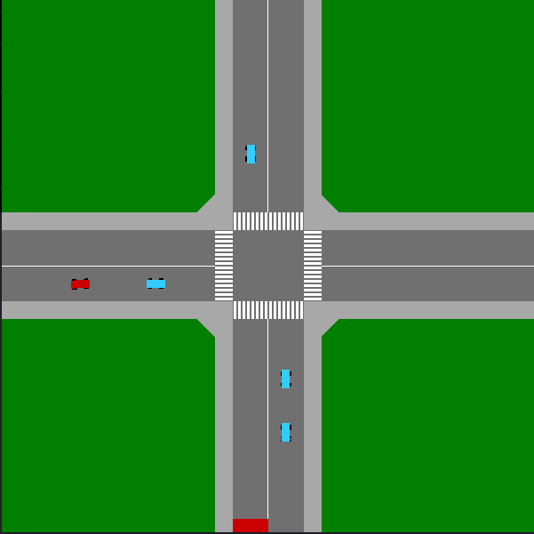

# Car Movement on a road intersection

This is a compatible with OpenAI gym enviroment which models movements of a car on a road intersection.

## Description

The environment is a road intersection. Your agent (red car) started along with some number (default is 4) of bot cars (blue cars) which move along random predefined trajectories, i.e. left, straight, right.

Your agent receives reward 10 after reaching a red rectangle and then the environment is reset.
Along the way some penalties would be appointed for moving in the wrong way.
Driving on sidewalks or colliding with another car in addition to penalty resets environment.

An agent is controlled by four actions (steer angle, gas, break).

The goal is to reach a destination in the fastest and safest way possible.

## Getting Started

To make this environment integral part of your gym please follow instructions in [OpenAI custom gym](https://github.com/openai/gym/tree/master/gym/envs#how-to-create-new-environments-for-gym).

### Prerequisites

Run:

```
pip install -r requirements.txt
```

Obviously you need also your favorite deeplearning framework to train an agent. (Make sure you did install box2d).
If you are still in trouble try:

```
pip install gym['box2d']
```

## Running the environment

If you want simply to check how the environment works just run:

```
python main.py
```

You can control an agent (red car) by arrow keys.

Some modifications is also available. See some flags below.

To set the number of bot cars:

```
python main.py --bots_number=2
```

To remove an agent completely from the picture:

```
python main.py --no_agent
```

To define your own start positions make changes in _start_file.csv_
This is how road looks like.
To make specific start just put start and end in the table below.
The quantity of bot cars is arbitrary. Put as much as you need.
Possible direction for path 3: 34, 36, 38. Similar for 5, 7 and 9.

   |   |   |
   | 9 | 8 |
\___|   |   |___
 2           7
___         ___
 3           6
___         ___
   |   |   |
   | 4 | 5 |
   |   |   |

Command to get data from file:

```
python main.py --using_start_file
```

To write positions of the cars while running environment run:

```
python main.py --write
```

The default file the data is written to is _car_racing_positions.csv_.
To change it:

```
python main.py --dir DIR
```

It keeps numbers for cars' positions after each tick in environment.
First three numbers is car_angle, car_pos_x, car_pos_y;
Then the same three numbers (angle, position x, position y) go for each bot car.
(FYI: Entire Playfield is from -60 to 60 units. Road width is 16 units.
      Center of crossroad is 0)


### Example

If everything is ok you will see the following picture:


